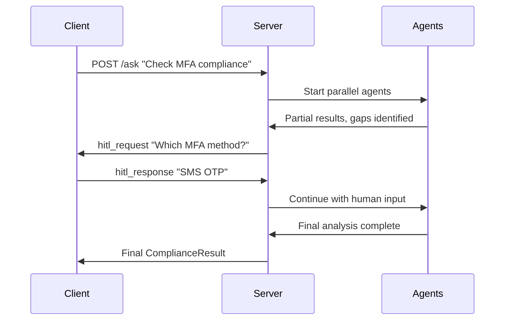

# AI Compliance & Risk Orchestrator

A multi-agent system for automated compliance checking with Human-in-the-Loop (HITL) capabilities. Built for the AI Software Developer Intern assignment.

## 🏗️ Architecture

### Core Components
- **FastAPI Server**: REST API + WebSocket endpoints
- **6 Specialized Agents**: Policy Retrieval, Evidence Collection, Vision/OCR, Code Scanning, Risk Scoring, Red Team Critic
- **DAG Orchestrator**: Parallel execution with `asyncio.gather()`
- **HITL System**: Server-initiated WebSocket requests to human client
- **Database Layer**: MongoDB (sessions/state) + Redis (caching)
- **RAG System**: FAISS vector store for policy/evidence retrieval

### Agent Workflow (DAG)
```
[Policy Retriever] ──┐
[Evidence Collector] ─┼─→ [Risk Scorer] ─→ [Red Team Critic] ─→ [Final Decision]
[Vision/OCR Agent] ───┤                                          ↑
[Code Scanner] ───────┘                                          │
                                                       [HITL Interruption Points]
```

## 🚀 Quick Start

### Prerequisites
```bash
# Install dependencies
pip install -r requirements.txt

# Optional: Start MongoDB and Redis (or use in-memory fallbacks)
docker run -d -p 27017:27017 mongo:latest
docker run -d -p 6379:6379 redis:latest
```

### Running the System

1. **Start the Server**
```bash
cd server
python main.py
# Server runs on http://localhost:8000
```

2. **Run HITL Client** (separate terminal)
```bash
cd client
python hitl_client.py
```

3. **Run Demo Scenarios**
```bash
cd demo
python demo_scenarios.py
```

## 🎯 Demo Scenarios

The system demonstrates three key scenarios as required:

### 1. Normal Compliant Decision (No HITL)
- Query: "Does our login system meet MFA requirements?"
- Agents run in parallel, find sufficient evidence
- Returns `compliant` decision automatically

### 2. HITL Workflow (2 Interruptions)
- Query: "Assess mobile authentication compliance"
- Red Team Critic identifies gaps, triggers 2 HITL requests:
  1. **Clarification**: "Which MFA method is used?"
  2. **Approval**: "Proceed with limited evidence?"
- Human responds via WebSocket, workflow continues

### 3. Insufficient Evidence (Timeout + Fallback)
- Query: "Review legacy mainframe compliance"
- Agents timeout or find limited evidence
- Returns `insufficient_evidence` with fallback reasoning

## 📊 API Reference

### REST Endpoints
```bash
# Start compliance analysis
POST /ask?query="Does our system meet Policy X?"
→ {"session_id": "uuid", "status": "started"}

# Get final result
GET /result/{session_id}
→ ComplianceResult JSON

# Get execution history
GET /history/{session_id}
→ Full session log with timings

# WebSocket for HITL
WS /connect?session_id={uuid}
```

### WebSocket Messages

**Server → Client (HITL Request)**
```json
{
  "type": "hitl_request",
  "data": {
    "session_id": "uuid",
    "request_id": "uuid", 
    "type": "clarification|approval|upload_request",
    "prompt": "Which MFA method do you use?",
    "required_artifact": "image|text"
  }
}
```

**Client → Server (HITL Response)**
```json
{
  "type": "hitl_response",
  "data": {
    "session_id": "uuid",
    "request_id": "uuid",
    "response_type": "text|approval|upload",
    "payload": {"answer": "SMS-based OTP"}
  }
}
```

**Server → Client (Progress Update)**
```json
{
  "type": "progress_update",
  "data": {
    "stage": "parallel_collection|risk_scoring|awaiting_human|finalized",
    "status": "started|completed|failed",
    "meta": {"agent_count": 4}
  }
}
```

## 🛡️ Guardrails & Safety

### Input Validation
- Rejects unsafe queries (hacking, exploits, malicious content)
- Ensures queries are compliance-related
- Rate limiting per session

### Output Validation
- Strict Pydantic schema validation
- Business logic consistency checks
- Citation requirements for decisions
- Sanitized output (removes potential secrets)

### Example Safe Refusal
```json
{
  "decision": "insufficient_evidence",
  "confidence": 0.0,
  "risk_score": 0.0,
  "rationale": "Request cannot be processed: Query contains potentially unsafe content. This system is designed for defensive compliance and risk assessment only."
}
```

## 🔧 Configuration

### Environment Variables
```bash
MONGODB_URL=mongodb://localhost:27017
REDIS_URL=redis://localhost:6379
DB_NAME=compliance_orchestrator
OPENAI_API_KEY=your_key_here  # Optional for enhanced agents
```

### Agent Timeouts
- Policy Retriever: 20s
- Evidence Collector: 25s  
- Vision/OCR: 15s
- Code Scanner: 20s
- Risk Scorer: 10s
- Red Team Critic: 15s

## 📈 Reliability Features

### Error Handling
- **Timeouts**: Each agent has configurable timeout
- **Retries**: 3 retries with exponential backoff using `tenacity`
- **Circuit Breaker**: Failed agents don't block workflow
- **Graceful Degradation**: Mock responses when real agents fail

### Parallel Execution
```python
# Core parallel execution pattern
collection_tasks = [
    self._run_agent_with_context("policy_retriever", query, context),
    self._run_agent_with_context("evidence_collector", query, context),
    self._run_agent_with_context("vision_ocr", query, context),
    self._run_agent_with_context("code_scanner", query, context)
]

results = await asyncio.gather(*collection_tasks, return_exceptions=True)
```

### State Management
- **MongoDB**: Session state, agent outputs, human interactions
- **Redis**: Caching with TTL, deduplication
- **In-Memory Fallback**: Works without external dependencies

## 🧪 Multimodal Support

### OCR Processing
- **Real OCR**: pytesseract with image preprocessing
- **Mock Fallback**: Demo-friendly responses when OCR fails
- **Supported Formats**: PNG, JPG, JPEG, TIFF, BMP

### Image Analysis Pipeline
1. Image preprocessing (denoising, contrast enhancement)
2. Text extraction with confidence scores
3. Compliance element detection (auth settings, security controls)
4. Integration into compliance reasoning

## 🎭 Example HITL Sequence



## 📋 Compliance Result Schema

```json
{
  "decision": "compliant|non_compliant|insufficient_evidence",
  "confidence": 0.85,
  "risk_score": 0.23,
  "rationale": "Analysis found MFA implementation with SMS OTP...",
  "citations": [
    {
      "doc_id": "POLICY-001",
      "chunk_id": "MFA-SEC-001", 
      "snippet": "Multi-factor authentication is required..."
    }
  ],
  "open_questions": ["What backup method is available if SMS fails?"],
  "human_interactions": [
    {
      "timestamp": "2024-01-15T10:30:00Z",
      "type": "clarification",
      "prompt": "Which MFA method is used?",
      "response": "SMS-based OTP",
      "status": "provided"
    }
  ]
}
```

## 🚧 Known Limitations & Trade-offs

### Current Limitations
- **Mock Agents**: Real implementations would integrate with actual policy databases, code repositories, and vision APIs
- **Simple RAG**: Production would use more sophisticated embedding models and reranking
- **In-Memory Fallback**: Not suitable for production without persistent storage
- **Basic OCR**: Real implementation would use cloud vision APIs for better accuracy

### Design Trade-offs
- **Speed vs Accuracy**: Parallel execution improves speed but may miss dependencies between agents
- **Safety vs Functionality**: Strict guardrails may reject legitimate edge cases
- **Simplicity vs Features**: Focused on core requirements rather than advanced features

### Production Considerations
- Add authentication/authorization
- Implement proper logging and monitoring
- Add comprehensive error handling
- Use production-ready databases
- Implement proper secrets management
- Add load balancing and scaling

## 🔍 Testing

```bash
# Run unit tests
pytest tests/

# Test specific scenarios
python demo/demo_scenarios.py

# Test individual components
python -m server.agents.policy_retriever  # Test single agent
python -m server.core.orchestrator        # Test orchestration
```

## 📝 File Structure

```
ai-compliance-orchestrator/
├── server/
│   ├── main.py              # FastAPI server + WebSocket
│   ├── agents/              # 6 specialized agents
│   ├── core/                # Orchestrator, RAG, Database
│   ├── models/              # Pydantic schemas
│   └── utils/               # OCR, helpers
├── client/
│   └── hitl_client.py       # WebSocket HITL client
├── demo/
│   └── demo_scenarios.py    # Three demo scenarios
├── tests/                   # Unit tests
├── requirements.txt         # Dependencies
└── README.md               # This file
```

## 🏆 Assignment Requirements Met

✅ **Multi-Agent Orchestration**: 6 agents with parallel execution  
✅ **HITL over Network**: WebSocket server-initiated requests  
✅ **Structured Output**: Pydantic schema validation  
✅ **State & Memory**: MongoDB + Redis with fallbacks  
✅ **Multimodal**: OCR for screenshot analysis  
✅ **Client-Server Protocol**: REST + WebSocket APIs  
✅ **Reliability**: Timeouts, retries, circuit breakers  
✅ **Guardrails**: Input validation, safe refusals  
✅ **Demo Scenarios**: All three required scenarios implemented

---

🤖 **Generated with Claude Code** - Ready for submission and demonstration!# ai-compliance-orchestrator

# ai-compliance-orchestrator

